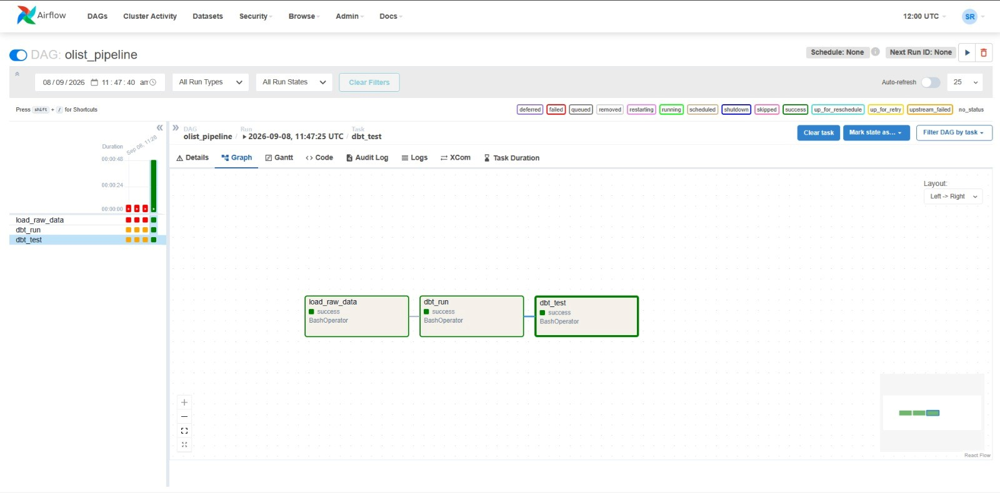
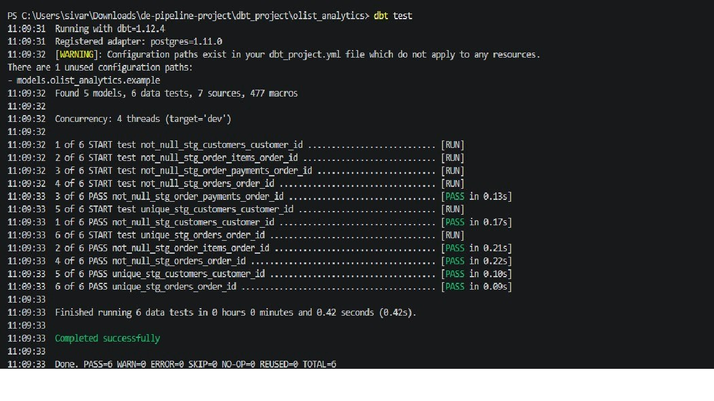

# Olist E-Commerce Data Pipeline

An end-to-end ELT pipeline that ingests raw e-commerce data, transforms it into analytics-ready models, and validates data quality — fully orchestrated by Apache Airflow and containerized with Docker.

## Architecture

[Olist CSVs]
│
▼
[Python loader script] ──► [PostgreSQL: raw schema]
│
▼
[dbt: staging models]
│
▼
[dbt: fct_orders mart]
│
▼
[dbt tests: data quality checks]

Entire flow orchestrated end-to-end by an Airflow DAG (load → transform → test),
running inside Docker containers.

## Stack
Apache Airflow · dbt-core · PostgreSQL · Docker · Python · Pandas · SQLAlchemy

## What it does
- Loads 9 relational tables (1.5M+ rows) from the Olist Brazilian E-Commerce dataset into a PostgreSQL warehouse
- Transforms raw data into staging models and a dimensional `fct_orders` mart using dbt
- Runs 6 automated data quality tests (uniqueness, not-null) on primary keys
- Orchestrates the entire load → transform → test flow through a single Airflow DAG
- Fully containerized — one command (`docker-compose up`) spins up Postgres, Airflow, and all dependencies

## Setup

1. Clone the repo:
git clone https://github.com/sivaranjaniraldy/airflow-dbt-postgres-pipeline.git
cd olist-data-pipeline
2. Download the [Olist Brazilian E-Commerce dataset](https://www.kaggle.com/datasets/olistbr/brazilian-ecommerce) from Kaggle and place the CSVs in `data/`
3. Copy `dbt_project/profiles.yml.example` to `dbt_project/profiles.yml` and adjust credentials if needed
4. Run:
docker-compose up airflow-init
docker-compose up -d
5. Open `http://localhost:8080` (admin/admin), un-pause and trigger the `olist_pipeline` DAG

## Results

   
   
   

## Problems I hit and how I fixed them

**1. psycopg2 build failure inside the Airflow container**
Installing `dbt-postgres` via Airflow's runtime `_PIP_ADDITIONAL_REQUIREMENTS` failed — the container lacked `pg_config`/build tools needed to compile `psycopg2` from source. Fixed by writing a custom Dockerfile that pre-installs `gcc` and `libpq-dev`, then bakes `dbt-core`/`dbt-postgres` into the image at build time instead of installing at container startup.

**2. DROP TABLE conflicts with dependent dbt views**
My initial loader script used `if_exists="replace"`, which drops and recreates raw tables on every run. Once dbt views (`stg_orders`, `fct_orders`) were built on top of those tables, Postgres refused to drop them: *"cannot drop table raw.orders because other objects depend on it."* This is a realistic production scenario — downstream models depend on upstream tables. Fixed by switching to a truncate-and-append strategy that preserves table structure and dependent views.

**3. Airflow log-serving 403 error across components**
Task logs failed to load in the UI with a 403 Forbidden error, caused by the webserver and scheduler not sharing the same `secret_key` (required for internal authentication between Airflow components). Fixed by setting a shared `AIRFLOW__WEBSERVER__SECRET_KEY` across all services in `docker-compose.yaml`.

## Project structure
├── dags/ # Airflow DAG definitions
├── scripts/ # Python data loading scripts
├── dbt_project/ # dbt models, tests, and config
│ └── olist_analytics/
│ └── models/
│ ├── staging/ # Staging models + source definitions
│ └── marts/ # Dimensional fact tables
├── data/ # (gitignored) raw CSVs
├── docker-compose.yaml
└── Dockerfile

# Save the file.

## Commit and push:

git add .
git commit -m "Add README with architecture, setup instructions, and debugging writeup"
git push